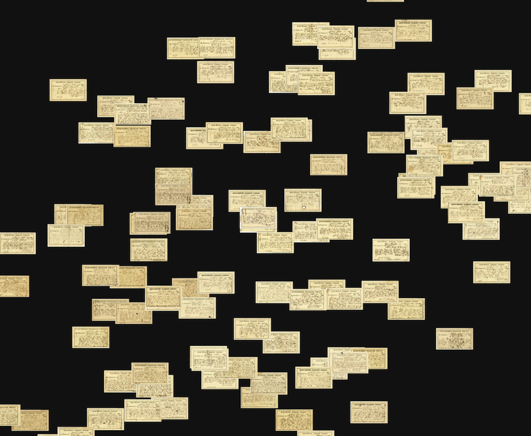
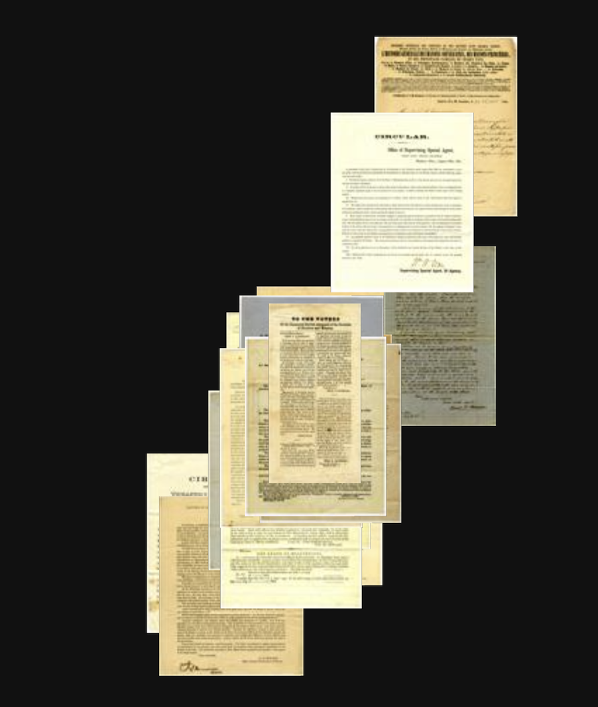
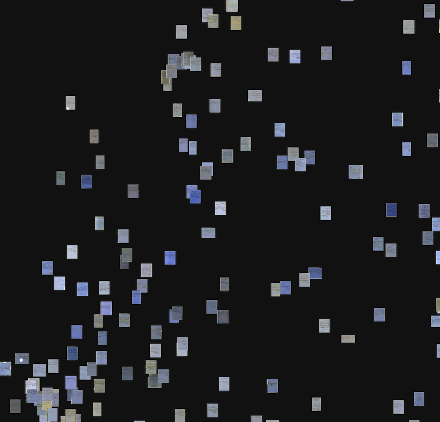
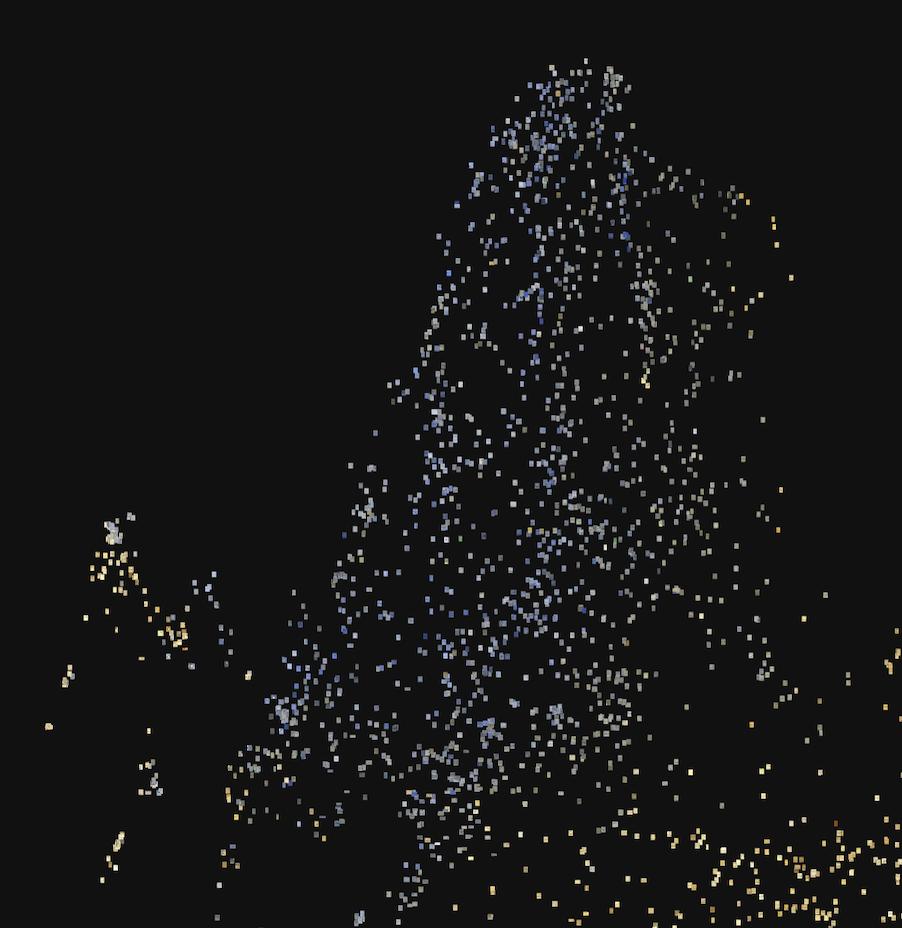

Handwritten archival materials present a unique challenge for automated tagging and categorization. Traditional optical character recognition (OCR) techniques still often struggle with the variability and complexity of handwritten text. As a result, most handwritten material is manually tagged and categorized by human archivists, which is a time-consuming and labor-intensive process. In many cases, historical documents may use a script or writing style that is no longer in common use. Most students are [no longer taught cursive](https://www.theatlantic.com/magazine/archive/2022/10/gen-z-handwriting-teaching-cursive-history/671246/), making it difficult for younger generations to read historical documents. While transformer models have shown promise in transcribing handwritten text, they require large amounts of labeled training data which is often not available for historical documents. Convolutional neural networks (CNNs) offer a promising alternative approach. By learning visual features directly from handwritten images, CNNs can potentially categorize and tag documents without requiring a full transcription.

To examine this, I decided to look at the handwritten materials currently being collected by the [Mississippi Civil War and Reconstruction Governor’s Project](https://cwrgm.org/) led by [Susannah J. Ural](https://www.history.msstate.edu/directory/abc123) at Mississippi State University and [Lindsey R. Paterson](https://lindseyraepeterson.com/) at the University of South Dakota. The Mississippi Department of Archives and History has been amassing a vast collection of handwritten letters sent to the state's governors by citizens since 1902. This extensive archive, spanning over a century, contains more than 20,000 letters dating back to 1859. To make these historical documents more accessible to researchers and the public, students have been diligently working on transcribing the letters manually. While this process is time-consuming, it provides a unique opportunity for the current research project.

At the time of scraping, there were approximately 7850 documents available. The archive has since been updated to almost 11800 documents. The documents span a wide range of topics, from personal correspondence to official government communications. Each document has been carefully transcribed and tagged with metadata such as the date, sender, recipient, and subject matter. Using [PixPlot](https://github.com/YaleDHLab/pix-plot), I was able to create a visual overview of the entire collection. PixPlot uses a convolutional neural network to extract visual features from each image and then projects those features into a 2D space using UMAP to conduct dimensionality reduction. Next, it utilizes [Hierarchical density-based spatial clustering of applications with noise](https://hdbscan.readthedocs.io/en/latest/how_hdbscan_works.html) (HDBSCAN), to identify clusters within the projected space. These clusters can potentially reveal patterns and groupings within the collection that may not be immediately apparent from the metadata alone.

[To view the PixPlot itself, click here.](https://nabeelsiddiqui.net/civil_war_and_reconstruction_governors/)

By exploring the PixPlot visualization, I noticed several distinct clusters of visually similar documents.

## Telegrams in Cluster 6

One cluster, labeled Cluster 6, contained a significant number of telegrams. Telegrams were a common form of rapid communication during the late 19th and early 20th centuries, often used for urgent or time-sensitive messages. The telegrams in this cluster were characterized by their brief, condensed language and standardized formatting, which typically included the date, sender, and recipient information at the top of the document, followed by the message itself.

## Printed Letters in Cluster 7

Another visually distinct cluster, labeled as Cluster 7, contained a high concentration of printed letters. These letters were likely produced using a typewriter or printing press, as evidenced by their uniform typography and layout. The presence of printed letters within the collection suggests that not all communications were handwritten and that some individuals or organizations may have had access to more advanced writing technologies. It also demonstrates that the CNN was able to effectively distinguish between handwritten and printed documents based on visual features alone.

## Blue Color Letters in Cluster 8

Cluster 8 contained a notable subset of letters written on blue-colored paper. The CNN was able to group these letters based on their distinctive color, demonstrating its ability to identify and cluster documents based on visual characteristics beyond just the content of the handwritten text. The use of blue paper may indicate a specific type of correspondence or a particular period when this color was more commonly used. Further analysis of the content and metadata associated with these letters could potentially reveal additional insights into their significance within the collection.

In fact, all of the blue-colored letters were grouped by UMAP at the top of the visualization. This spatial grouping suggests that the use of blue paper was not evenly distributed throughout the collection, but rather concentrated within a specific subset of documents.

