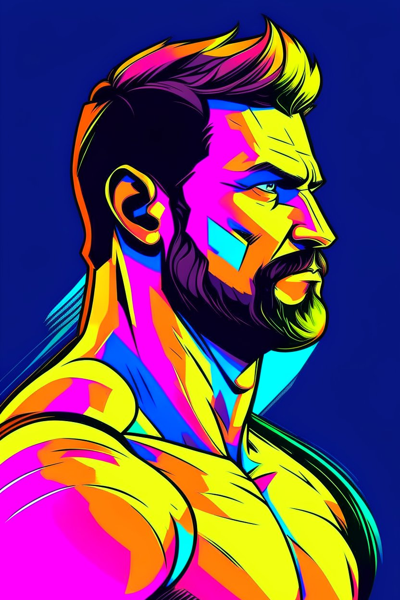
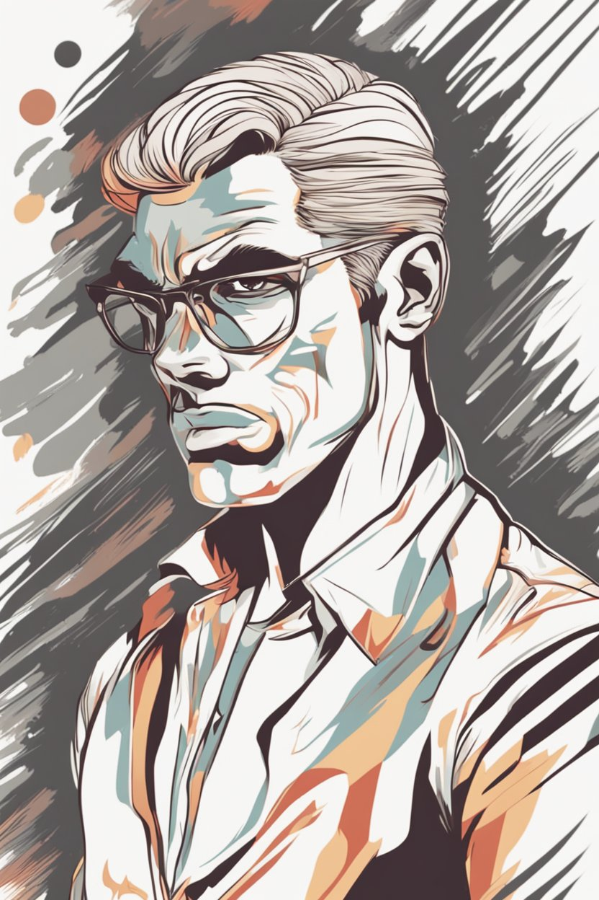

For the last few years, I have had my students explore AI image generation using text prompts. It's been a fascinating journey to see how the technology has progressed and what students can create with it. When the technology had not been so prominent, I used to have the students do a small competition using [Runway](https://runwayml.com/). At first, it was very difficult for students to get good results, as the models were not as advanced.

However, as the technology improved, students were able to create increasingly impressive images with their prompts. Perhaps more importantly, the “wow” factor had gone. Two or three years ago almost no student had tried an image generator. Now, although they tend to use large-language models like ChatGPT more, they are a lot less amazed by the product. The models for video generation, such as [Gen-2](https://research.runwayml.com/gen2), are not very convincing.

For those who are unaware, numerous models for image generation give slightly different results based on the same prompt. When working with students, it's important to discuss the ethical implications of AI-generated images, such as potential biases in the training data. A lot of times, they believe these biases only occur with images of minorities, but the results affect all images. Consequently, I found one of the best ways to get students to understand the limitations is to have them generate images using the same prompt with two different models. We then create a slider showcasing the different prompts.

I realized that I had never really taken time out to really create them myself, so I figured this would be a good time to try out different diffusion models. I have found that [StableCog](https://stablecog.com/generate) seems to provide a generous free tier with different diffusion models, and the sliders can be created fairly easily in [Flourish](https://flourish.studio/) or [Juxtapose](https://github.com/NUKnightLab/juxtapose). I especially wanted to try vector graphics since those usually require a lot of manual work in programs like Adobe Illustrator. I was curious to see how well the AI could handle vector graphics compared to traditional methods.

None of these models advertise themselves as being for vector graphics, but it is worth exploring to see how well they perform, and students seem to enjoy pushing these models to their limits. Anyway, here are some differences between the models using the same prompt. I got most of them from [StableCog's Gallery](https://stablecog.com/gallery) but added terms related to vector graphs:

> Prompt: A vector drawing of a man with masculine and strong features represents a successful, strong and unbreakable mentality ,Side shot of face and body , single man ,high quality , 8k , colorful , in digital illustration style

 

<link rel="stylesheet" href="https://cdn.knightlab.com/libs/juxtapose/latest/css/juxtapose.css">

> Prompt: vector image of a a coarsely shaved, raggedly dressed, post apocalyptic, female cyberpunk scavenger , with highly detailed and deeply cut facial features, searing lines and forceful strokes, precisely drawn, boldly inked, with gritty textures, vibrant colors, dramatic otherworldly lighting

> Prompt: Vector style anthropomorphic fox casting a spell for video game art, 8k, realistic, dramatic lighting, holding coffee in one hand and casting spell with a wand in the other hand