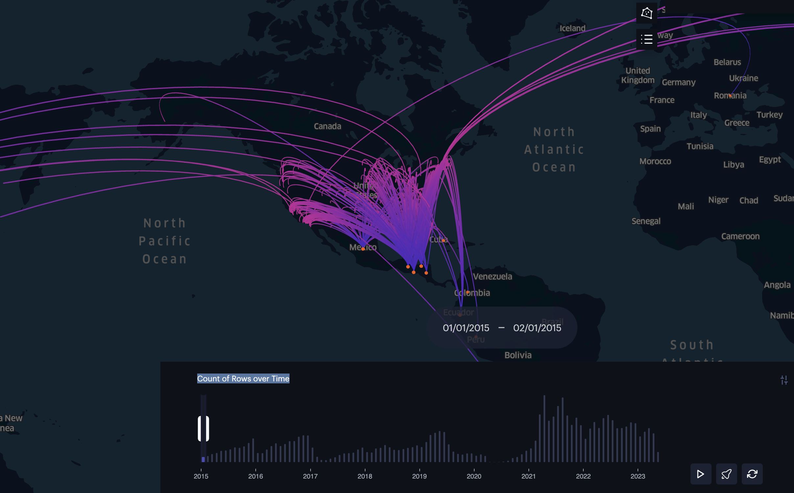
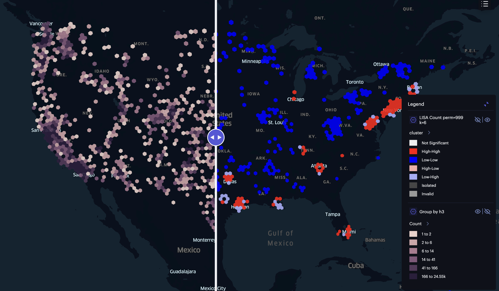

In the last blog post, I worked on the [data set that the New York Times released](https://github.com/nytimes/hhs-child-migrant-data) about unaccompanied migrant children in the United States. These are children who have crossed the border into the United States without their parents or legal guardians. 

A particularly useful element of the data is the spatial and time data. We have information about when individuals entered the United States, their country of origin, and where they were placed. This allows for some interesting analysis and visualizations. For instance, we can see that while there are children from around the globe, we have a large concentration of individuals from Central America, particularly Guatemala, El Salvador, and Honduras. I figured creating an arc map would allow us to see some of these trends better.

Below, if you click the image, you will be taken to a map that allows you to visualize the movement of unaccompanied migrant children from their countries of origin to their placement locations in the United States.

**Click the Image Below to See an Arc Map**

However, simply knowing where these individuals land is not useful in and of itself. Frequently, I have found that many individuals beginning their first journey into data science or data analytics will not take into account the dependent nature of the data. One way we can solve this is mixed models, but this becomes trickier with the spatial data. [Tobler’s first law of geography](https://en.wikipedia.org/wiki/Tobler%27s_first_law_of_geography) states that “everything is related to everything else, but near things are more related than distant things.” For example, if we are looking at the number of unaccompanied migrant children in a particular area, we need to consider the characteristics of the surrounding areas as well. One thing that we can use to do this is [Cluster and Outlier Analysis with Anselin Local Moran's I.](https://pro.arcgis.com/en/pro-app/latest/tool-reference/spatial-statistics/cluster-and-outlier-analysis-anselin-local-moran-s.htm) Through it, we can get four results:

- High-High
- Low-High
- High-Low
- Low-Low

The middle two are particularly interesting because they represent outliers in the data. A High-Low result indicates an area with a high number of unaccompanied migrant children surrounded by areas with low numbers. Conversely, a Low-High result indicates an area with a low number of unaccompanied migrant children surrounded by areas with high numbers. These outliers can provide valuable insights into the factors influencing the distribution of these children across the United States, such as local policies, community support, or economic conditions.

While enumeration units (e.g., counties, provinces, countries, zip codes) are useful, they may not accurately represent the spatial relationships between data points. This is because many of these are arbitrary. Thus, we need to standardize these into some shape through a [geospatial indexing system](https://benfeifke.com/posts/geospatial-indexing-explained/). These can help minimize some of the effects of [the modifiable areal unit problem](https://en.wikipedia.org/wiki/Modifiable_areal_unit_problem). Popular ones are [Google’s S2](http://s2geometry.io/) and [GeoHash](http://s2geometry.io/). However, I have recently become obsessed with [Uber’s H3](https://www.uber.com/blog/h3/). Not only does it solve some issues with the previous ones that are not worth getting into here, but it is baked into [Foursquare Studio](https://studio.foursquare.com/), which is my GIS software of choice.

You will see two maps separated by a slider if you click on the image below. On the left side, we see grids at [resolution 4](https://h3geo.org/docs/core-library/restable/) with the number of unaccompanied migrant children. The darker the color, the higher the number of children. On the right side, we see the results of the Anselin Local Moran's I analysis based on the counts of each H3 cell. A benefit of doing this is that we can also run a [permutation test](https://en.wikipedia.org/wiki/Permutation_test). Below, I have used six neighbors to reflect each side of the hexagon and 999 permutations. Furthermore, I have filtered to only show [statistically significant results](https://en.wikipedia.org/wiki/Statistical_significance) based on a 0.05 alpha value.

**Click the Image Below to See the Results of the Cluster and Outlier Analysis using Anselin Local Moran's I**

As you will notice, we did not have any outliers. This suggests that the distribution of unaccompanied migrant children across the United States is relatively consistent, with areas of high and low concentrations clustering together. Nonetheless, it is essential to note that this analysis is based on a snapshot of the data and does not account for changes over time.