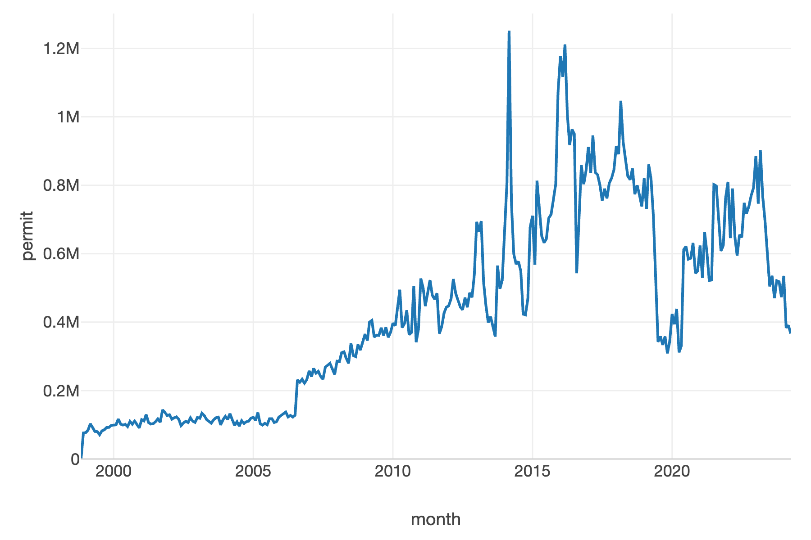
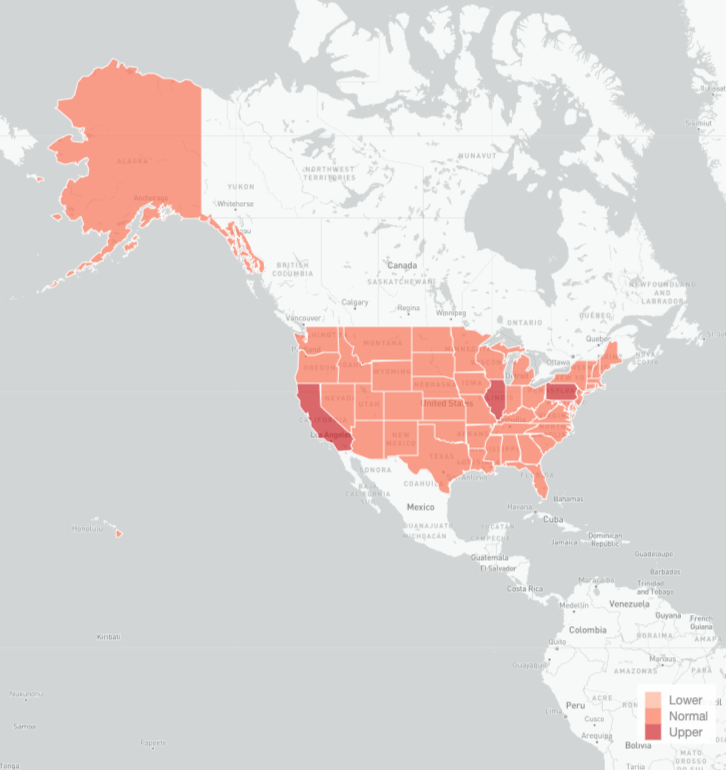
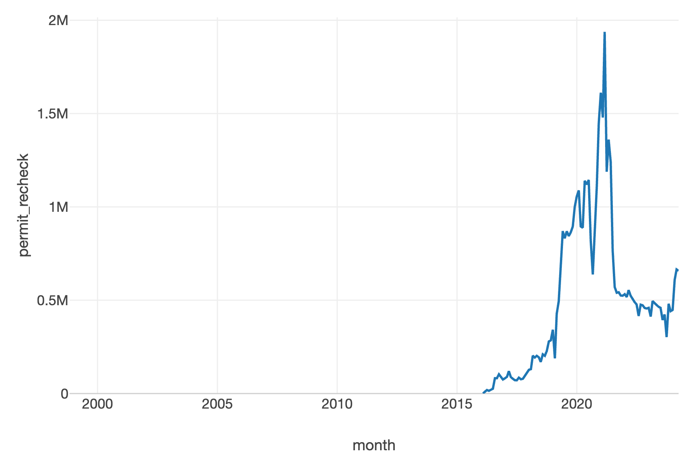

The debate over gun ownership and regulation in the United States remains a contentious issue, with arguments often centered around interpretations of the Second Amendment, public safety concerns, and the effectiveness of existing policies. To inform these discussions, examining the available data on firearm sales and background checks is crucial.

In this blog post, we'll be diving into the [FBI's National Instant Criminal Background Check System (NICS) data, as compiled by the Data Liberation Project](https://github.com/data-liberation-project/nics-firearm-background-checks). NICS was mandated by the [Brady Handgun Violence Prevention Act of 1993](https://en.wikipedia.org/wiki/Brady_Handgun_Violence_Prevention_Act) and launched by the FBI in 1998. It's used by Federal Firearms Licensees (FFLs) to determine whether a prospective buyer is eligible to purchase firearms or explosives.

While the NICS data is often used as a proxy for gun sales, it's important to note that it represents the number of background checks initiated, not the number of firearms sold. Various factors, such as differences in state laws and the exclusion of private sales, mean that there isn't a perfect one-to-one correlation between background checks and gun sales.

Despite these limitations, the NICS data remains a valuable resource for understanding trends and patterns in firearm transactions across the United States. This analysis will explore how background check volumes have changed over time, examine variations across states, and discuss potential factors driving these trends.

I downloaded the data in May of 2024, which [you can explore here](../assets/firearm_background_reports/Firearm%20Background%20Reports%20May%202024.csv). However, because the data for 2024 is still incoming, I decided to filter it to December of 2023. 

## Permit Checks

To begin our analysis, let's look at the top 10 states with the highest number of permit checks in the most recent year of data. These permit checks are used by some states as an alternative to the standard NICS background check process. As we can see Illinois and Pennsylvania are the top two states on the list, with Illinois being significantly higher than any other state. This is likely due to Illinois' [Firearm Owners Identification (FOID) card system](https://en.wikipedia.org/wiki/Firearm_Owner%27s_Identification), which requires all firearm owners to obtain a permit before purchasing or possessing firearms.

It's worth noting that the presence of a state on this list doesn't necessarily indicate higher overall gun ownership rates, as it may simply reflect differences in the background check process and reporting requirements.

In the line chart below, we see an increase in 2006 and a large spike around 2015. Further research needs to determine the precise causes of this surge.

By dividing the permits by interquartile range, we can identify outliers and better understand the distribution of permit checks across states. The map below shows the relative intensity of permit checks, with darker shades indicating higher volumes. We can see that Illinois, California, and Pennsylvania stand out, while most other states have lower levels of permit checks. 

## Permit Rechecks

In addition to initial permit checks, some states also conduct periodic rechecks to ensure permit holders remain eligible. We see that Kentucky dominates this list. Likely, this is due to Kentucky's \[shall-issue concealed carry permit system\]([https://www.usconcealedcarry.com/resources/ccw\_reciprocity\_map/ky-gun-laws/](https://www.usconcealedcarry.com/resources/ccw_reciprocity_map/ky-gun-laws/)), which requires permit holders to renew their permits every five years. This regular renewal process likely accounts for the high volume of permit rechecks in Kentucky.

We only have information after 2015, but we see a growing increase in permit rechecks over time, with a notable spike in 2020. This could be attributed to a combination of factors, such as increased gun sales during the COVID-19 pandemic, heightened political tensions, and growing concerns about public safety. The decline in numbers near the end is likely a result of missing data for the most recent months, as reporting may be delayed.

## Examining Gun Type

A box plot showing the distribution of background checks across different gun types can provide insights into consumer preferences and market trends. In this plot, we see that handguns have the highest median number of background checks, followed by long guns and multiple guns. The presence of outliers in the handgun and long gun categories suggests that there may be certain states or periods with exceptionally high volumes of background checks for these gun types.

The donut plot below shows that handguns account for 55.85% of the total background checks, followed by long guns at 37.15%. Multiple guns, which likely represent transactions involving the purchase of more than one firearm, make up a much smaller portion.

## Prophet Forecast of Monthly Permits

Using [Facebook’s Prophet](https://facebook.github.io/prophet/), we see that the model predicts a leveling off in monthly permit checks over the next few years. This forecast aligns with the overall trend observed in the line chart, which showed a significant increase in permit checks around 2015 followed by a gradual stabilization in recent years. However, it's important to note that these predictions are based on historical patterns and do not account for potential future events or policy changes that could impact firearm sales and background checks. Ongoing monitoring and analysis of the data will be crucial to understanding the evolving landscape of gun ownership in the United States.

