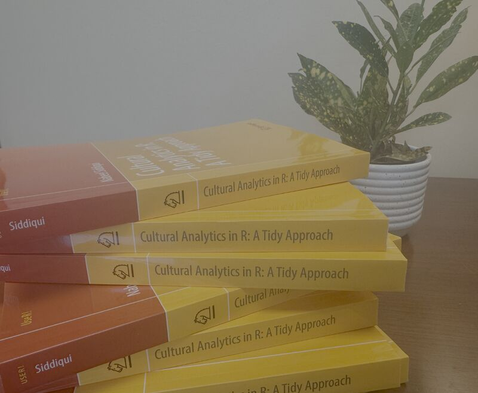

Exciting news: my book *Cultural Analytics in R: A Tidy Approach* has just been published by SpringerLink! This is the first book that brings together the many ways tidy data principles can be used across cultural analytics workflows. I'm grateful to everyone who has expressed interest in this project and supported its development. 🙏

## What This Book Is All About

So what exactly is *Cultural Analytics in R*? Well, it's my attempt to fill a gap I've been thinking about for years—how do we get humanities folks comfortable with computational methods without scaring them away with too much technical jargon? As historian Roy Rosenzweig pointed out way back in 2003, we've moved from "a culture of scarcity to a culture of abundance" in our digital world. Suddenly, we have access to massive archives of cultural data, but most humanities scholars weren't really trained to handle that scale of information.

This book is designed to bridge that gap between traditional humanities research and what Lev Manovich calls cultural analytics—"the analysis of massive cultural data sets and flows using computational and visualization techniques." But here's the thing: this isn't about replacing close reading or interpretive analysis. It's about giving scholars new tools that can reveal patterns they might not see otherwise. 

## Why R? (And Why Not Python or Something Else?)

I get this question a lot! R might seem like an odd choice since it's mainly known for statistics R has an amazing ecosystem of packages that all work together really well, especially when you're dealing with different types of cultural data—text, images, numbers, geographic information—sometimes all in the same project. These packages work with "tidy data" (thanks, Hadley Wickham!). It's basically a way of organizing your data that makes everything else easier. Once you get the hang of it, you can move seamlessly between different data types. 

## What's Actually In The Book

I tried to make this as hands-on as possible, using datasets that are actually interesting (no boring spreadsheets of random numbers!). Here's what we cover:

- **Getting Started**: We dive right in with Olympic athlete data—120 years worth—to learn the basics without getting overwhelmed
- **Data Wrangling**: Using American film data from the 1960s to today to master the "tidyverse" (trust me, it's less intimidating than it sounds)
- **Making Pretty Graphs**: Learning ggplot2 with a dataset of 90,000 songs and their emotional tags
- **Text Analysis**: Diving into works by F. Scott Fitzgerald, Charlotte Perkins Gilman, and Mary Shelley
- **Statistics That Actually Make Sense**: Using Pokémon battle data to understand regression (because who doesn't want to predict which Pokémon will win?)
- **Network Analysis**: Exploring connections in early African American cinema
- **Machine Learning**: Looking at how artists are represented in art history textbooks

Each chapter builds on the last, but I've tried to make sure you're always working with real cultural data that tells interesting stories.

## Numbers + Narrative = Better Research

Here's something I really want to emphasize: this isn't about choosing between "data" and "interpretation." That's a false choice that's held back humanities research for too long.

As Manovich puts it, the best cultural analytics work is "focusing on the particular, interpretation, and the past from the humanities, while centering on the general, formal models, and predicting the future from the sciences." In other words, you can zoom out to see the big patterns *and* zoom in for close analysis.

Maybe you're looking at thousands of comic book covers to understand visual rhetoric, or tracking how video game aesthetics have evolved, or (like I've done) mapping where academic conferences happen and who gets to attend. The computational tools help you see the forest, but you still need traditional humanities skills to understand what the trees are actually doing.

## Who Should Read This

If you're a humanities scholar who's curious about computational methods but feels intimidated by all the technical jargon, this book is for you. I wrote it assuming readers know nothing about programming or statistics—seriously, we start from the very beginning and through examples that actually matter to humanities research.

## Want to Check It Out?

If this sounds interesting, Springer is offering a discount code: **SPRAUT**. You can grab a copy here: [Cultural Analytics in R: A Tidy Approach](https://link.springer.com/book/10.1007/978-3-031-96618-7)

The book's part of Springer's "Use R!" series, which has some additional fantastic resources for learning R across different fields. And 

## What's Next?

Cultural analytics is still a pretty young field, which means there's tons of room for experimentation and discovery. This book gives you the foundational skills, but I'm also hoping it gets people to think critically about what it means to use computational methods in cultural research—including the ethical questions and potential pitfalls.

I'm genuinely excited to see what people do with these methods. Learning to code can be frustrating at first (trust me, I remember!), but there's something really satisfying about finally getting your computer to help you answer questions you've been wondering about for years.

Thanks to everyone who's supported this project along the way. 