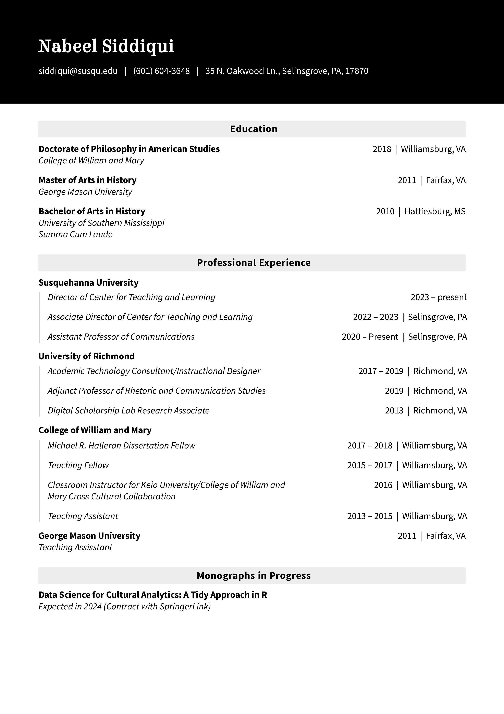
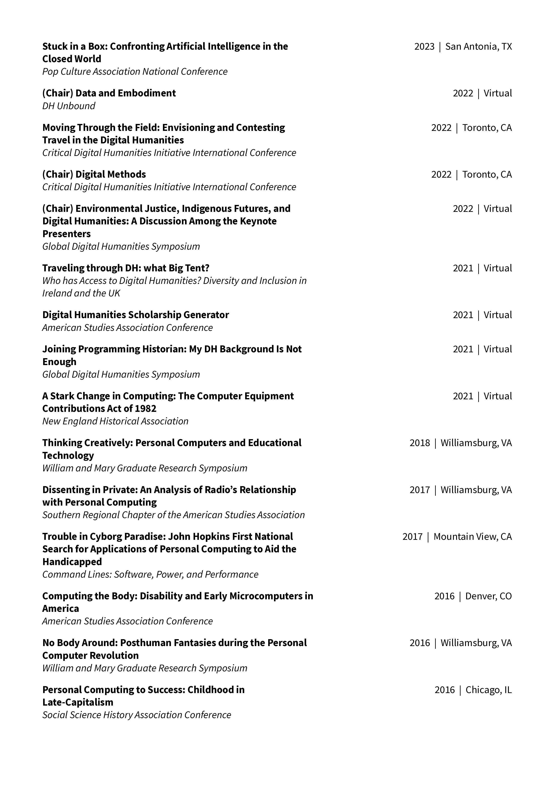
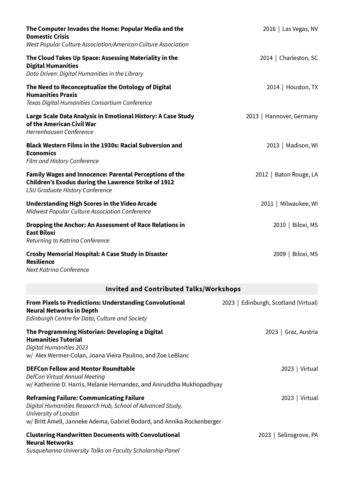
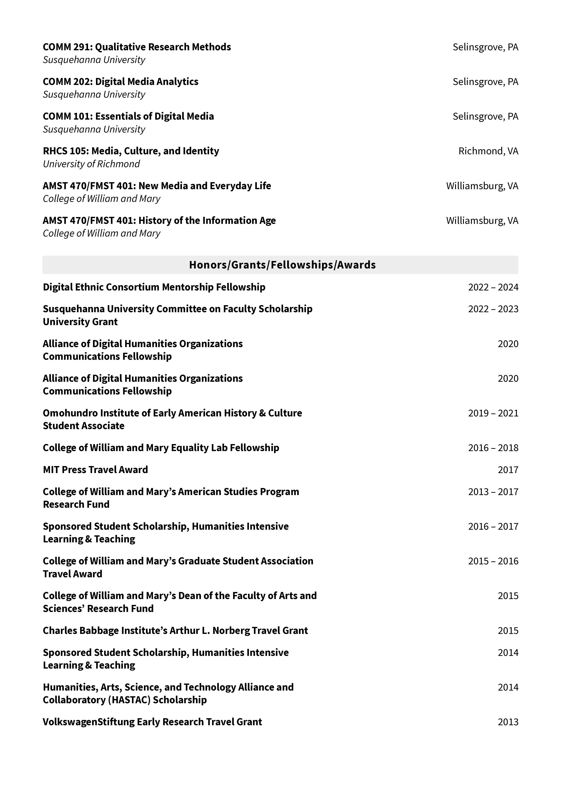

Below is a copy of my CV if you would like to learn more about my research, publications, and teaching experience. I'm always happy to collaborate on new projects. References are available upon request. 

If you would like to contact me, please feel free to reach out at my [university email](mailto:siddiqui@susqu.edu). 

 
 
 
 
 
 
 
