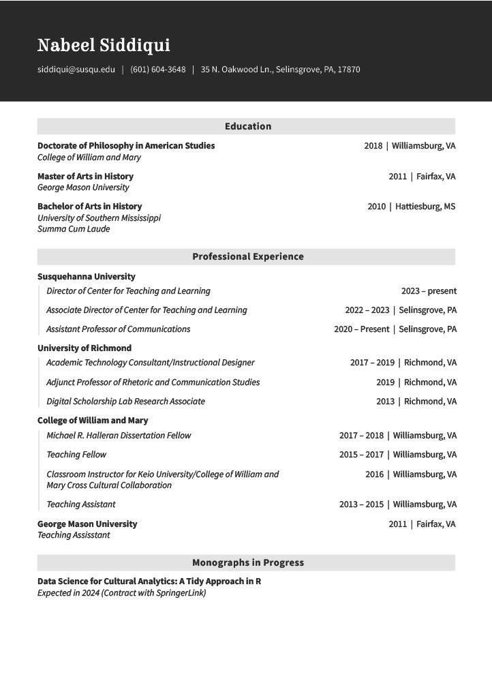
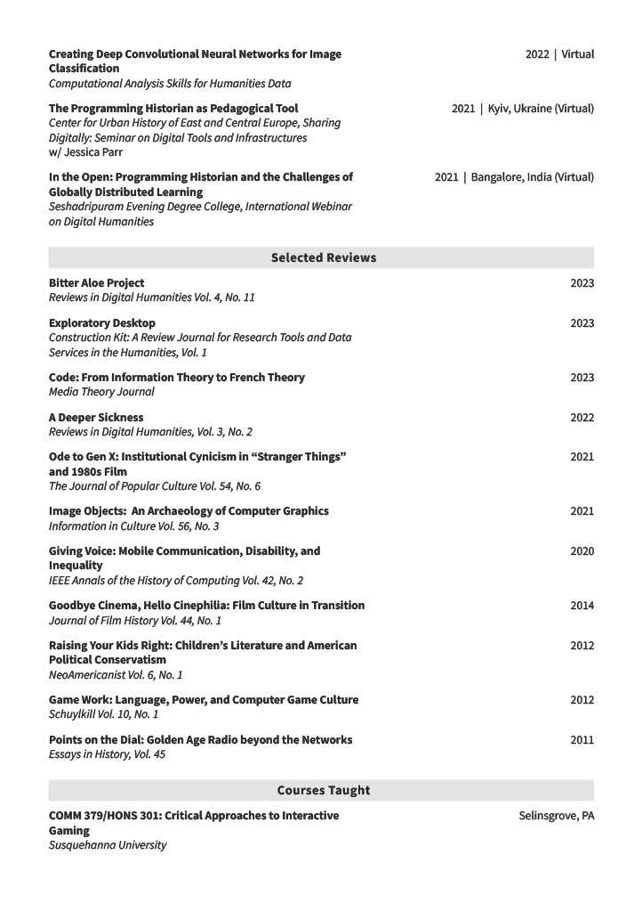
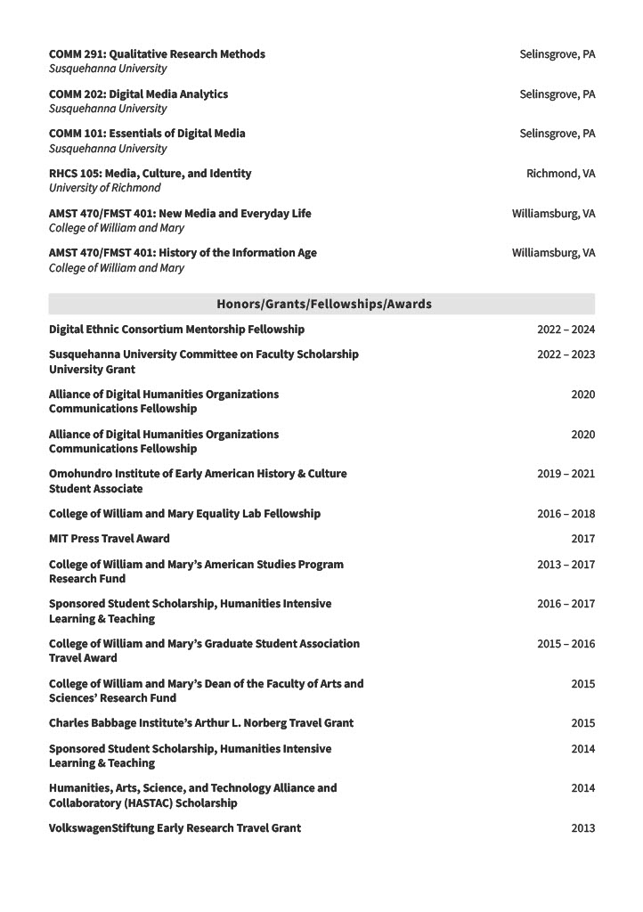
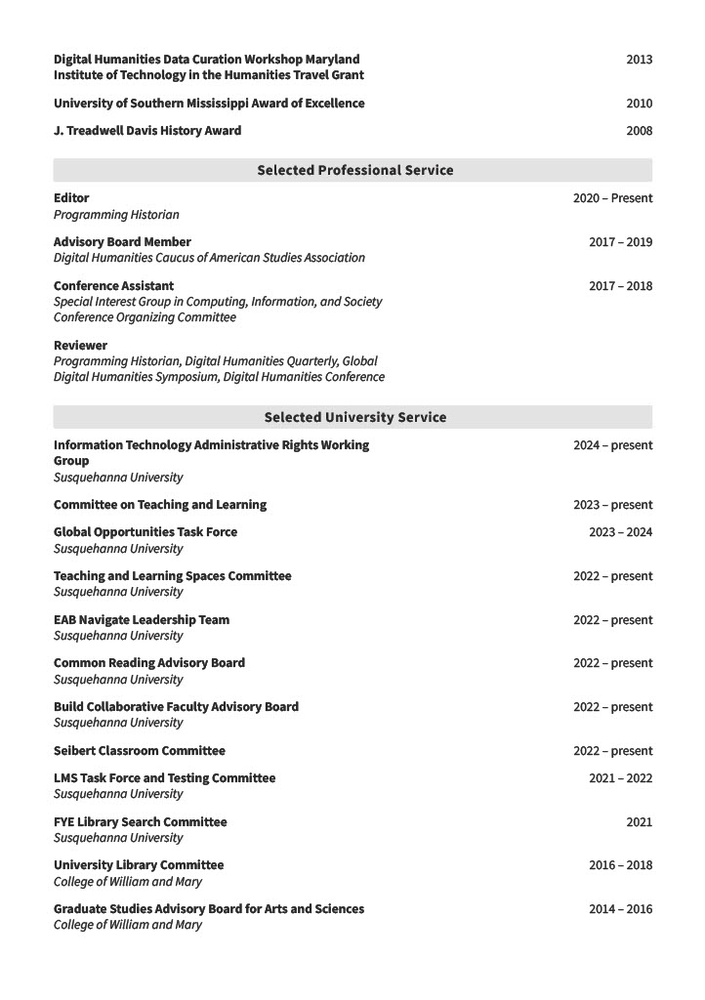
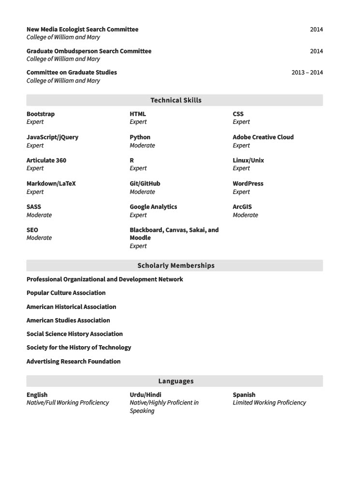

# CV

Below is a copy of my CV if you would like to learn more about my research, publications, and teaching experience. I'm always happy to collaborate on new projects. References are available upon request.

 
 
 
 
 
 
 
